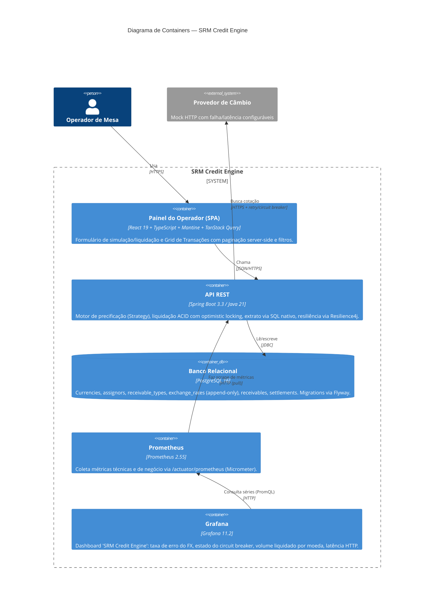

# C4 — Nível 2: Diagrama de Containers

Detalha os blocos de execução (containers, no sentido C4 — não necessariamente Docker) que compõem o SRM Credit Engine e como se comunicam.

## Containers

| Container | Tecnologia | Responsabilidade |
|---|---|---|
| Painel do Operador (SPA) | React 19, TypeScript, Mantine, TanStack Query | UI de simulação/liquidação e grid de transações. Não replica a fórmula de precificação — sempre chama `POST /simulations`. |
| API REST | Spring Boot 3.3, Java 21 | Camadas: `application` (controllers/DTOs/exception handling), `domain` (Strategy de pricing, serviços de simulação/liquidação/câmbio), `persistence` (entidades JPA + repositório de relatório em SQL nativo). |
| Banco Relacional | PostgreSQL 16 | Fonte única de verdade transacional. Constraints de banco (`UNIQUE`, `CHECK`, trigger append-only) reforçam invariantes que a aplicação também valida — defesa em profundidade. |
| Prometheus | Prometheus 2.55 | Scrape de `/actuator/prometheus` (métricas técnicas do Spring/JVM + métricas de negócio customizadas: `settlements_count_total`, `settlements_volume_*`). |
| Grafana | Grafana 11.2 | Dashboard provisionado via `docker-compose` (datasource + dashboard as code), sem setup manual. |

O provedor de câmbio é externo ao boundary do sistema — no ambiente local ele é simulado (`MockExchangeRateProviderController`), mas a fronteira arquitetural (client HTTP + Resilience4j) é a mesma que existiria contra um provedor real de mercado.

Ver [c4-context.md](./c4-context.md) para a visão de mais alto nível e [high-scale-design.md](../high-scale-design.md) para como esses containers evoluiriam sob carga de produção em escala.
