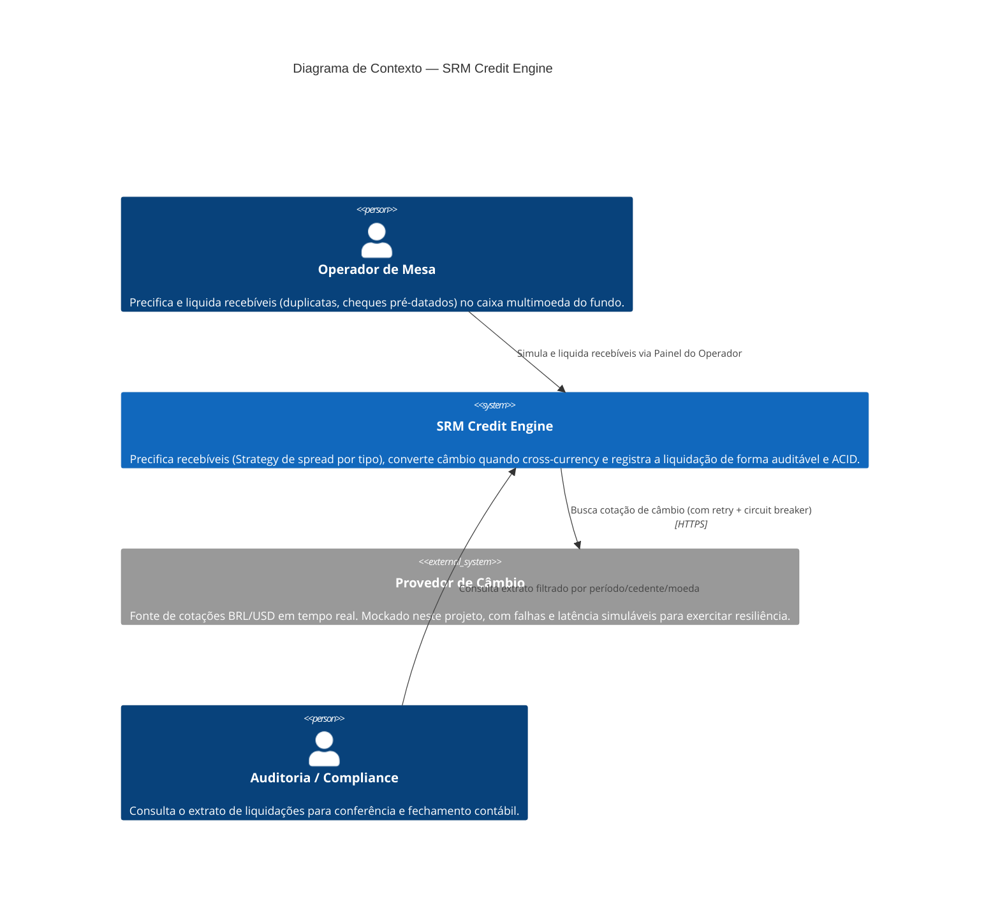

# C4 — Nível 1: Diagrama de Contexto

Visão de mais alto nível: quem usa o SRM Credit Engine e com que sistemas externos ele troca informação.

## Atores e sistemas

- **Operador de Mesa**: usuário primário. Registra recebíveis, simula o valor líquido antes de decidir, e executa a liquidação (individual ou em lote).
- **Auditoria/Compliance**: consumidor do "Extrato de Liquidação" (`GET /reports/settlements`), com filtros de período, cedente e moeda de pagamento.
- **Provedor de Câmbio**: dependência externa. No mundo real seria uma API de mercado (ex. um banco ou serviço de FX); aqui é simulado (`MockExchangeRateProviderController`) com taxa de falha e latência configuráveis via `FX_MOCK_FAILURE_RATE`/`FX_MOCK_MAX_LATENCY_MS`, para provar o comportamento de fallback do sistema sob instabilidade real de rede.

Ver [c4-container.md](./c4-container.md) para o próximo nível de detalhe (os blocos internos do sistema).
