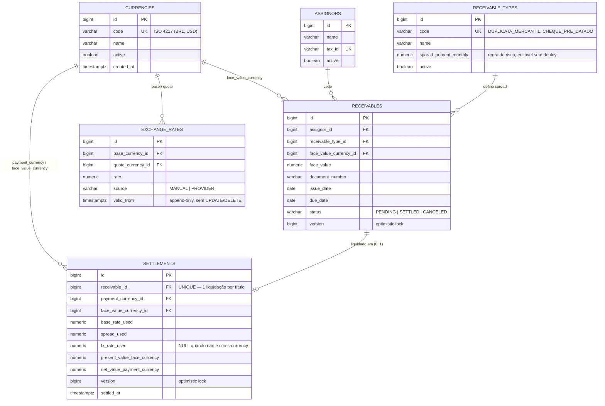

# Diagrama ER — SRM Credit Engine

Derivado das migrations Flyway (`backend/src/main/resources/db/migration/V1`–`V6`), que
são a fonte de verdade do schema. Este diagrama é uma leitura de apoio; o DDL executável
vive nas próprias migrations.

## Notas de modelagem

- **`exchange_rates` é append-only** (trigger de banco impede `UPDATE`/`DELETE` — ver
  [ADR 0003](../adr/0003-exchange-rates-append-only.md)): a "taxa vigente" é sempre a
  linha mais recente por par de moeda, preservando o histórico para auditoria.
- **Dupla proteção contra liquidação concorrente/duplicada** (ver
  [ADR 0004](../adr/0004-concurrency-control-settlement.md)): `receivables.version`
  (optimistic lock, camada de aplicação) + `settlements.receivable_id UNIQUE`
  (constraint física, camada de banco).
- **`fx_rate_used` é nulável**: liquidações same-currency (ex. recebível em BRL pago em
  BRL) não passam por conversão cambial.
- **Todos os valores monetários são `NUMERIC(19,6)`**, nunca `FLOAT`/`DOUBLE` — ver
  [ADR 0002](../adr/0002-bigdecimal-precision.md).
